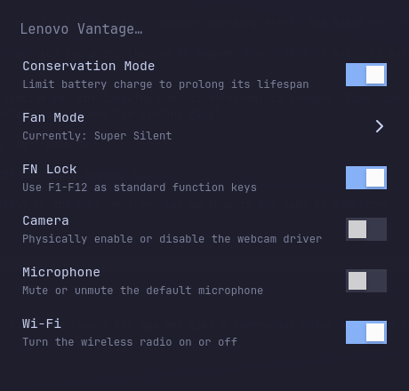

# Vantage for Omarchy

A native GTK4/libadwaita control panel that brings [Lenovo Vantage](https://www.lenovo.com/us/en/software/vantage)-style
hardware controls to Linux, styled to match [Omarchy](https://omarchy.org/) and driven by real
toggle switches instead of dialog menus.

This is an **Omarchy-only fork** of [niizam/vantage](https://github.com/niizam/vantage): the
installer, styling and key binding below all assume Arch Linux + Hyprland + Omarchy. It won't
try to detect or support anything else.



## :rocket: Features

* Conservation Mode (limit battery charge to prolong its life)
* Always-On USB (charge devices via USB while the laptop is off)
* Thermal/Fan Mode (silent, standard, dust cleaning, efficient)
* FN Key Lock
* Camera Privacy Switch
* Microphone Privacy Switch
* Touchpad Switch
* Wi-Fi Switch
* Launch from your Lenovo Smart/Vantage key, or search for it like anything else in Omarchy's menu

Hardware toggles are applied through a small privileged helper authorized by a scoped
polkit policy (`org.vantage.helper`), so switching them on/off doesn't prompt for a password
on every change — only Wi-Fi, touchpad and microphone (which don't need root) run unprivileged
directly.

## :zap: The Smart/Vantage key

Many Lenovo laptops have a dedicated key for launching Vantage — sometimes a star or lightning
bolt icon, sometimes just the Insert key without Fn. What that key actually sends isn't
consistent across models (commonly `XF86Favorites`, but not always), so it's never hardcoded
here.

`make install` offers to bind it for you right after installing: press the key when prompted and
Vantage captures whatever it actually sends, then wires it up in
`~/.config/hypr/bindings.lua`. You can skip that prompt and set it up (or change it) whenever
you like:

```bash
vantage-bind-key            # capture a key press and (re)bind it to launch Vantage
vantage-bind-key --unbind   # remove the binding
```

## :art: Omarchy styling

Vantage always restyles itself to match Omarchy — sharp corners everywhere, and outlines/accents
taken live from the current Omarchy theme (`~/.local/state/omarchy/current/theme/colors.toml`).
Switching your Omarchy theme and reopening Vantage picks up the new accent color automatically.

## :computer: Installation

```bash
git clone https://github.com/yopaZH/omarchy-vantage.git
cd vantage
sudo make install
```

This installs dependencies via `pacman`, copies the app and helper into place, and offers to
bind your Smart/Vantage key. Launch "Lenovo Vantage" from Omarchy's app menu, or press your
bound key.

## :hotsprings: Uninstall

```bash
sudo make uninstall
```

Also removes the key binding set up by `vantage-bind-key`, if any.

## :warning: Requirements

Installed automatically by `sudo make install` via `pacman`:

* `python-gobject`, `gtk4`, `libadwaita` (>= 1.4, for `Adw.SwitchRow`)
* `polkit`
* `xorg-xinput`
* `networkmanager`
* `wev` (used by `vantage-bind-key` to detect key presses)
